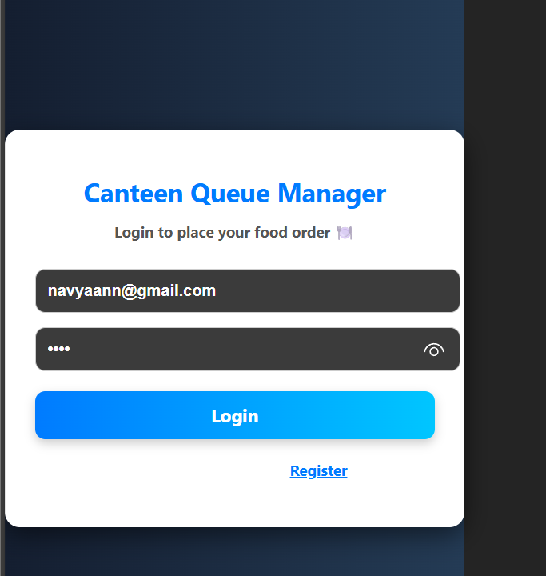
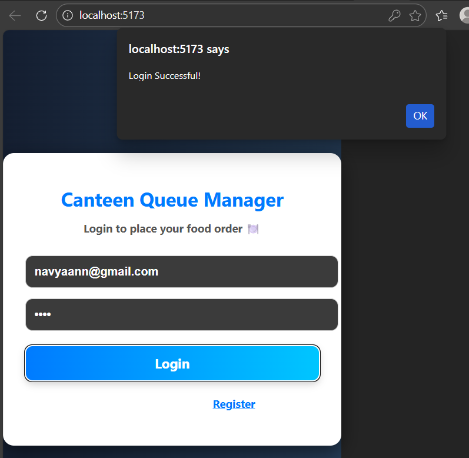
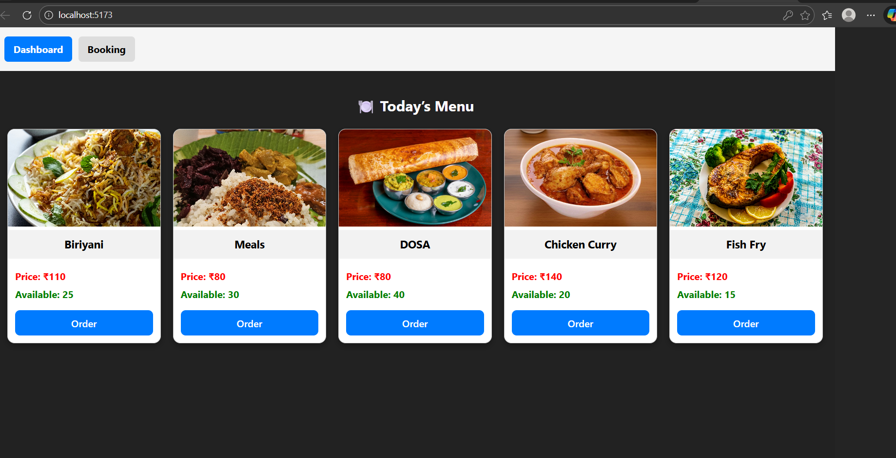
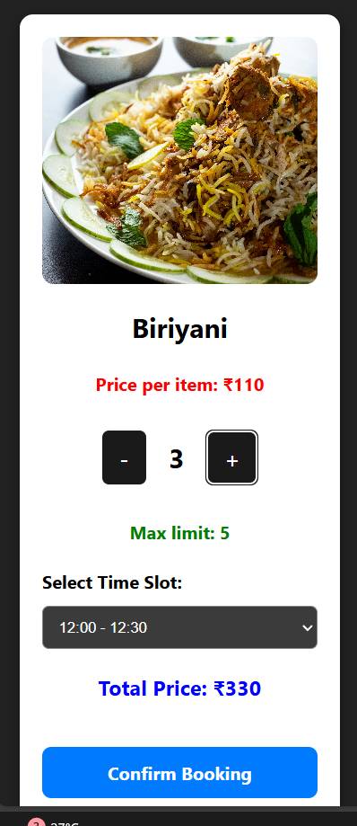
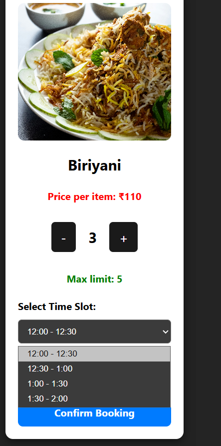
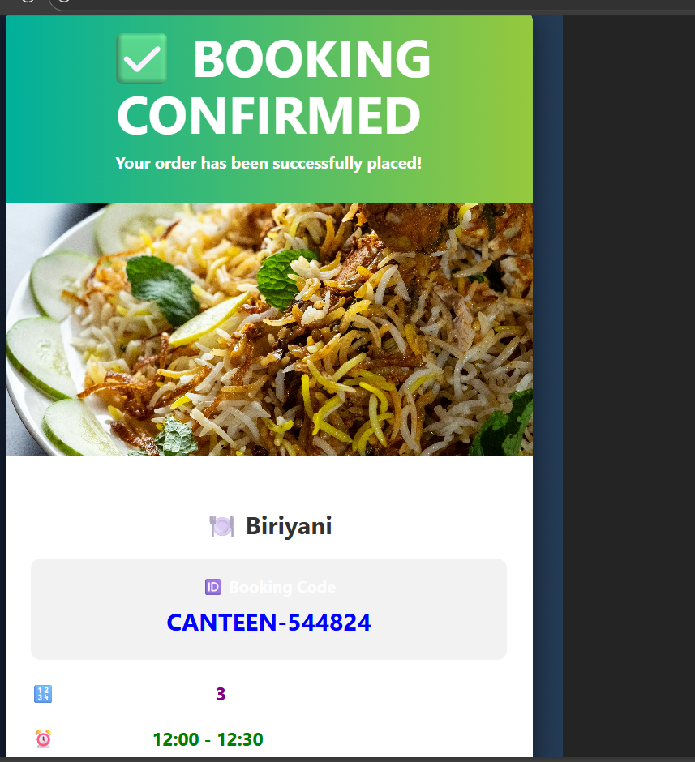
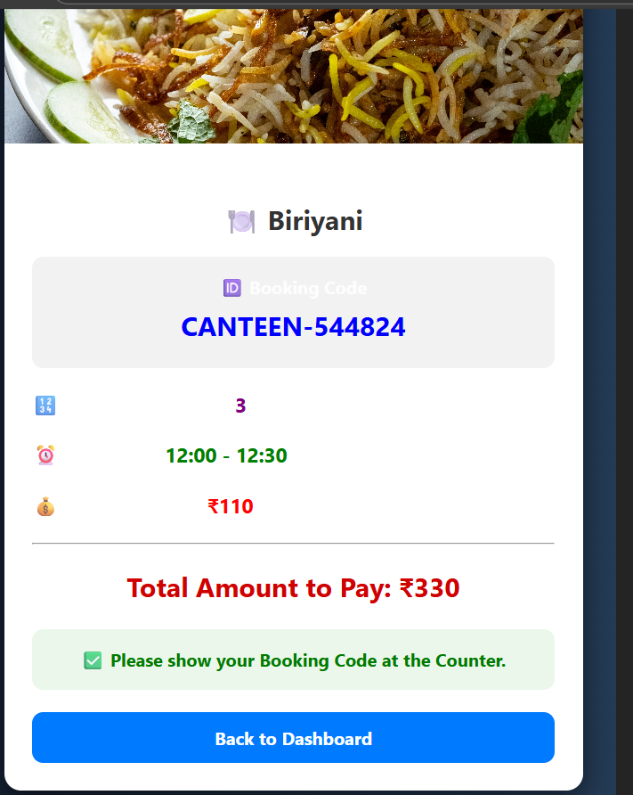
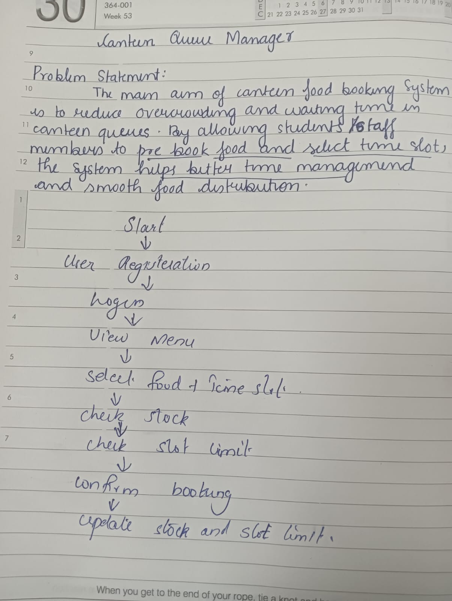

CANTEEN QUEUE MANAGEMENT SYSTEM
BASIC DETAILS
TEAM NAME: [TEAM NOVA]
TEAM MEMBERS
 MEMBER 1:NAVYA ANN MATHEW
 MEMBER 2:SUSAN SAJI
 HOSTED PROJECT LINK
 https://github.com/susansaji/canteen-queue-management
 DESCRIPTION:
The Canteen Queue Management System is a web application built using React (frontend) and Flask (backend) with MySQL database. It allows users to view menu items, place orders, and helps the canteen manage orders and item availability efficiently.
PROJECT STATEMENT:
Canteens often face long queues during peak hours, causing time wastage, overcrowding, and inefficient manual order handling. A digital system is needed to reduce waiting time and manage orders smoothly.
SOLUTION:
The solution is a Canteen Queue Management System developed using React for the frontend and Flask for the backend, connected with a MySQL database. It allows users to view the menu, place orders online, and reduces waiting time by managing orders digitally while updating food availability automatically.
TECHNICAL DETAILS:
TECHNOLOGIES/COMPONENTS USED:
SOFTWARE USED:
LANGUAGES USED:JAVASCRIPT,PYTHON,
FRAMEWORK USED: REACT,FLASK
LIBRARY USED:AXIOS,React DOM,Vite,mysql-connector-python
DATABASE USED : MySQL
TOOLS USED :VS CODE,GIT
Features
FEATURE1: Menu Display System – Users can view available food items with price and quantity.
FEATURE2:Online Order Placement – Customers can place orders directly through the application.
FEATURE3:Order Management / Tracking – Admin or staff can view all orders placed in real time.
FEATURE4:Automatic Stock Update – Available quantity of food items is automatically reduced after each order.
IMPLEMENTATION:
Installation commands:npm install,package.json,node.js,pip install
Run commands -  npm start,npm run dev, python app.py
PROJECT DOCUMENTATION

workflow diagram:

